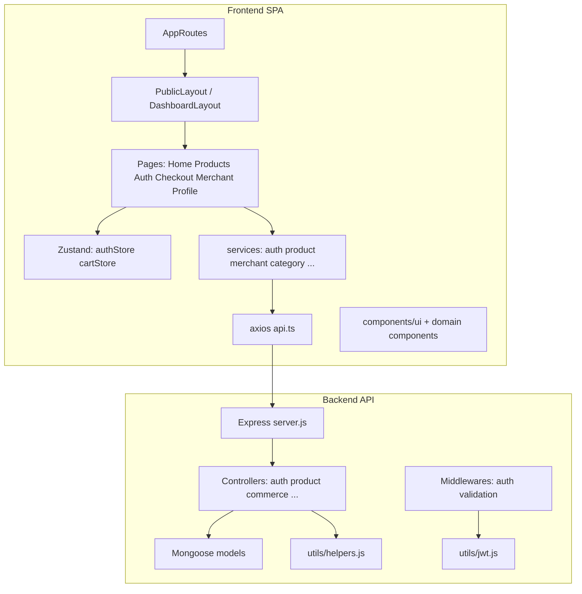

# Mapa de dependencias — refactor

**Estado:** documentación de planificación.  
**Última actualización:** 2026-05-14.  
**Nota:** Complementa detalle por archivo en cada `docs/audits/*.md`.

---

## 1. Grafo conceptual (alto nivel)

---

## 2. Frontend — módulos y acoplamientos

| Capa | Artefactos | Dependencias clave | Riesgo / nota |
|------|------------|----------------------|----------------|
| **Entrada** | `App.tsx`, `AppRoutes.tsx` | Layouts, páginas, lazy (pendiente) | `HomePage` importado pero ruta activa usa `NewHomePage` (código muerto de import). |
| **Layouts** | `PublicLayout`, `DashboardLayout` | Navbar, Footer, offset `pt-32` vs heroes | Colisión layout/hero (home-audit). |
| **Marketing** | `NewHomePage`, `AboutUsPage` | `productService`, `categoryService`, cart | Stats duplicadas; `ProductCard` inline. |
| **Catálogo** | `ProductsPage`, `ProductDetailPage` | `productService`, categorías, stores | Sort/paginación desalineados con backend; sin `useSearchParams`. |
| **Auth UI** | Login, Register, Verify, SelectRole, CompleteMerchant, OAuthCallback, SocialLoginButtons | Auth: mix **axios** (`authService` / store) vs **`fetch` directo** en varias páginas | Bypasea interceptores y política única de errores (auth-audit). |
| **Checkout / pago** | `CheckoutPage`, `WompiReturnPageFixed`, `WompiPayment` | Notificaciones, cart, API pagos | Tres variantes de retorno Wompi en repo; rutas públicas usan `WompiReturnPageFixed` (`AppRoutes` L93–95). `pages/payment/WompiReturnPage.tsx` y `checkout/WompiReturnPage.tsx` quedan como deuda de divergencia. |
| **Merchant** | `MerchantProducts`, órdenes, analytics | `merchantService` → `/api/commerce/products` | Formato `{ productos }` vs `{ datos }` del catálogo. |
| **Estado global** | `stores/authStore.ts`, `stores/cartStore.ts` | persist localStorage; `cartStore` → hot-toast | Solo **dos** stores Zustand; la “duplicación” auditada es **patrón repetido** de fetch de categorías sin cache compartido, no dos stores de carrito. |
| **HTTP** | `services/api.ts` | interceptores, baseURL | `window.location` en 401; logs sensibles (auth-audit). |
| **Utilidades** | `imageUtils`, `debugUtils`, `imageTest` | `fetch` HEAD/GET en algunos | Más superficie `fetch` fuera del cliente canónico. |

### 2.1 `fetch(` directo detectado (2026-05-14 grep en `frontend/src`)

| Ubicación | Uso |
|-----------|-----|
| `pages/auth/RegisterPage.tsx` | registro |
| `pages/auth/SelectRolePage.tsx`, `CompleteMerchantProfilePage.tsx` | `seleccionar-rol` |
| `components/auth/SocialLoginButtons.tsx` | `firebase-login` |
| `components/profile/NotificationCenter.tsx` | notificaciones |
| `utils/imageUtils.ts`, `debugUtils.ts`, `imageTest.ts` | utilidades / debug |

**Implicación:** violación sistemática de “un solo cliente HTTP” en auth y notificaciones; debe migrarse según `decisions.md` DEC-FE-001.

---

## 3. Backend — módulos y acoplamientos

| Módulo | Archivos típicos | Consumido por | Nota |
|--------|------------------|---------------|------|
| **Auth** | `authController.js`, `authRoutes.js`, `middlewares/auth.js`, `utils/jwt.js`, `config/passport.js`, `config/firebaseAdmin.js` | Todo el frontend autenticado | Lógica monolítica; JWT duplicado; rutas Passport muertas para el cliente actual. |
| **Products público** | `productController.js`, `productRoutes.js` | Home, catálogo, detalle | Lógica pesada en controller; `incrementarVistas` no llamado. |
| **Commerce comerciante** | `commerceController.js` (p. ej. `gestionarProductos`), `commerceRoutes.js` | `merchantService` | Duplicación lógica con `productController`; transformación imágenes omitida en listado. |
| **Categorías** | `categoryController.js` | Múltiples páginas en paralelo | Sin capa de cache en cliente. |
| **Helpers** | `utils/helpers.js` | Respuestas paginación, transformación productos | **Doble `module.exports`** — segundo bloque pisa al primero (products-audit C7). |

---

## 4. Contratos datos críticos (frontend ↔ backend)

| Tema | Estado documentado | Bloquea |
|------|-------------------|---------|
| Sort `ordenar` | Guión `precio-asc` vs `precio_asc` | UX catálogo / confianza |
| Paginación | `limitePorPagina` vs `elementosPorPagina` | Tipos y UI futura |
| `Product.imagenes` | Objeto `{url,...}[]` vs `string[]` en TS | `getFirstImageUrl` defensivo |
| `Product.especificaciones` | Array `{nombre,valor}` vs `Record` | Edición en `ProductForm` |
| Listados comerciante | `productos` vs `datos` | `merchantService` vs catálogo |
| Auth password | `currentPassword` vs `passwordActual` | Features muertas |

---

## 5. Dependencias externas relevantes (sin añadir nuevas)

| Paquete / servicio | Rol actual | Observación |
|--------------------|------------|-------------|
| Axios | Cliente principal | Debe ser canónico. |
| Firebase Web + Admin | OAuth actual | Passport en backend queda paralelo y no usado por FE. |
| Zustand + persist | Auth + carrito | Revisar TTL y estrategia de token (decisions DEC-AUTH-002). |
| Tailwind + `index.css` | Estilos | Duplicación de tokens y utilidades redefinidas. |
| `react-hot-toast` | Usado en `cartStore` | Sin `<Toaster />` documentado en App (ui-system-audit). |
| `@headlessui/react` | En `package.json` | Sin usos en `src` al momento de la auditoría UI. |

---

## 6. Imports circulares

Las auditorías **no** listan ciclos concretos. **Recomendación:** en una fase de higiene (P3), ejecutar `madge` o `dependency-cruiser` sobre `frontend/src` y `backend` y adjuntar resultado a este documento. **Riesgo elevado** en módulos muy grandes (`authController`, páginas checkout) por acoplamiento interno, no necesariamente por `import` circular.

---

## 7. Referencias cruzadas

- Detalle de archivos y líneas: `docs/audits/*.md`  
- Decisiones de consolidación: `docs/roadmap/decisions.md`  
- Fases backend/frontend/UI: `docs/roadmap/*-roadmap.md`
