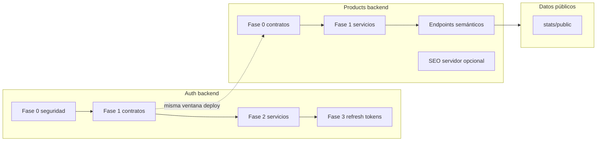

# Roadmap — Refactor backend (estrategia global)

**Estado:** planificación · **Implementación:** no iniciada en este documento  
**Fuentes:** `docs/audits/auth-audit.md`, `docs/audits/products-audit.md`, `docs/audits/home-audit.md` (dependencias de datos públicos), `docs/audits/ui-system-audit.md` (impacto indirecto en contratos de notificación/checkout)  
**Fecha de síntesis:** 2026-05-14

---

## 1. Objetivo

Orquestar el refactor backend como **plataforma estable y auditable**: seguridad primero, **contratos API únicos**, capa de **servicios** testeable, datos honestos para el frontend, y bases para **escalabilidad** (índices, paginación correcta, menos handlers monolíticos).

---

## 2. Prioridades (orden operativo)

| Prioridad | Qué significa en este repo |
|-----------|----------------------------|
| 1 · Estabilidad / seguridad | Cerrar vectores críticos de auth (JWT, CORS, backdoor, rate limit, mock Firebase, tokens en URL, enumeración). |
| 2 · Quick wins | `JWT_SECRET` fail-fast, quitar logging de bodies con passwords, pin HS256, CORS en prod, fixes de `errorResponse` mal usado. |
| 3 · Reducción de deuda | `authController` monolito; `productController` + `commerceController` duplicados; `helpers.js` doble `module.exports`; aliases de query sin documentar. |
| 4 · Reutilización | `services/auth/*`, `services/productService.js` compartido entre rutas públicas y comerciante; helpers JWT únicos. |
| 5 · UX/UI (vía API) | Respuestas consistentes (paginación, errores), evitar leaks que rompen confianza; mensajes al cliente en español con contrato en un idioma. |
| 6 · Performance | `Promise.all` en detalle de producto donde aplique; índices para relacionados; incremento de vistas con `findOneAndUpdate`; regex escapado. |
| 7 · Escalabilidad | Menos lógica en controllers; eventos de seguridad (`AuthEvent`); endpoints semánticos cacheables (`/stats/public`, destacados/recientes/ofertas). |

---

## 3. Principios de ejecución

1. **Auth fases 0–1 son bloqueantes para producción** (auth-audit): ningún otro refactor debe competir por atención hasta cerrar hemorragia y contratos rotos.
2. **Un idioma de contrato API** (auth-audit D3; alineado con api-rules): mensajes de usuario pueden ser ES; paths y payloads consistentes.
3. **Controllers delgados:** toda regla de negocio migrable a `services/` con pruebas unitarias donde el ROI sea claro (auth, productos, pagos si aplica).
4. **Cambios de contrato versionados o coordinados:** renombrar `limitePorPagina` → `elementosPorPagina` implica deploy backend+frontend en ventana acordada o compatibilidad temporal.
5. **Observabilidad:** sustituir `console.log` por logger estructurado con redacción (auth-audit F6 / products B1).

---

## 4. Carriles y dependencias

- **Products Fase 0** y **Auth Fase 1** comparten disciplina de “contrato único”; conviene una **convención de release** común (ej. etiqueta `breaking-api`).
- **Endpoints semánticos** (destacados, recientes, ofertas) desbloquean Home frontend sin abusar de `getProducts` (home-audit + products-audit).

---

## 5. Fases propuestas (solo estrategia)

### B0 — Auth: detener hemorragia (auth-audit Fase 0)

- Eliminar backdoor de super-admin en runtime; script CLI aislado.
- CORS estricto en producción; rate limits dedicados en rutas sensibles; sin `skipSuccessfulRequests` que anule brute-force.
- Sin mock Firebase en producción; fallar cerrado.
- Eliminar logs que imprimen credenciales.

**Resultado:** riesgo legal y de reputación reducido; base para cualquier otro deploy.

### B1 — Auth: contratos y comportamiento correcto (auth-audit Fase 1)

- Alinear cambio/reset de password; arreglar lectura de `token` en reset; JWT sin querystring en OAuth; `generarTokenAcceso` con firma correcta.
- Enforzar verificación de email o flujo de estado coherente.
- Proteger `seleccionar-rol` con token de transición.
- Resolver enum `administrador` vs eliminar rol (decisión D4).

**Resultado:** features dejan de estar “muertas”; permisos coherentes con BD.

### B2 — Products: contratos y sanidad del código (products-audit Fase 0 + fragmentos de F1)

- Enum de sort unificado; paginación con nombres alineados al frontend.
- Tipos de datos alineados con Mongoose (`imagenes`, `especificaciones`).
- Un solo `module.exports` en `helpers.js`; eliminar endpoints fantasma **o** implementarlos de verdad (decisión D2).
- `transformarProductos` también en lista comerciante; quitar ObjectIds inventados en categorías (riesgo de datos huérfanos).
- Escapar regex de búsqueda; invocar `incrementarVistas` en detalle.

**Resultado:** frontend puede simplificar código defensivo; sorts y KPIs dejan de mentir.

### B3 — Capa de servicios y consolidación de rutas

- **Auth:** dividir en servicios (login, register, password, verification, oauth, tokens) según auth-audit Fase 2.
- **Products:** `backend/services/productService.js` unificando listados; un solo endpoint para “mis productos” (products-audit D1).
- **JWT:** una sola verificación en `utils/jwt.js` consumida por middleware.

**Resultado:** menos duplicación entre `productController` y `commerceController`; tests enfocables.

### B4 — Modelo de sesión avanzado (auth-audit Fase 3)

- Access token corto + refresh rotable + revocación; política de almacenamiento (cookie httpOnly + CSRF vs localStorage) según D1.
- Interceptor frontend coordinado (documentado en frontend roadmap).

**Resultado:** sesiones revocables, menor blast radius de robo de access token.

### B5 — Endurecimiento y trazabilidad

- Consolidar verificación email / resend (auth-audit Fase 5).
- `AuthEvent` o equivalente para auditoría de seguridad.
- Política de passwords alineada con frontend (D7).
- Linking OAuth seguro (cerrar takeover por email — auth-audit M16 / D6).

### B6 — SEO servidor y datos públicos (opcional según producto)

- `GET /api/stats/public` cacheado si las métricas son reales (home-audit D1).
- `sitemap.xml` / feeds si se busca SEO más allá de SPA (products-audit F6.8).

---

## 6. Quick wins explícitos (lista corta)

1. `process.exit(1)` si falta `JWT_SECRET` (sin fallback).
2. Eliminar endpoint `create-super-admin` de `server.js`; reemplazar por script operado por infra.
3. Pin `algorithms: ['HS256']` en `jwt.verify`.
4. Corregir handlers que llaman `errorResponse` dos veces (auth-audit C15).
5. Unificar `crearPaginacion` con clave `elementosPorPagina` (products-audit C5).
6. Arreglar doble export en `helpers.js` (products-audit C7).
7. `incrementarVistas` en `GET /products/:id` (products-audit C9).

---

## 7. Decisiones globales (mesa de arquitectura)

Registrar decisión explícita antes de implementar:

| ID | Tema | Opciones resumidas | Bloquea |
|----|------|-------------------|---------|
| BD1 | Idioma contrato API | EN paths/campos vs ES completo | Auth F1, Products F0 |
| BD2 | Admin existe | Enum + rutas vs eliminar rol | Auth F1, guards |
| BD3 | OAuth único | Firebase vs Passport | Auth F2 |
| BD4 | Storage sesión | Cookie refresh + CSRF vs localStorage | Auth F1/F3 |
| BD5 | Endpoints semánticos producto | Implementar vs eliminar del cliente | Home/Products |
| BD6 | Endpoint comerciante | `/commerce/products` vs `/products/mis-productos` | Products F1 |
| BD7 | URLs públicas | slug vs id vs híbrido | Products F6 + redirects |

---

## 8. Riesgos y mitigaciones

| Riesgo | Mitigación |
|--------|------------|
| Cambios breaking en mobile apps o integraciones | Inventario de consumidores del API; versionado `/api/v2` solo si hay clientes externos. |
| Big-bang auth | Mantener fases mergeables de auth-audit; feature flags solo si aportan (no por defecto). |
| Regresión en pagos Wompi | Tocar checkout solo tras carril de notificaciones/UI estable (coord. con frontend). |

---

## 9. Métricas de seguimiento

- Endpoints `/api/auth` de 14 → ~9 (auth-audit tabla).
- LOC `authController` y `productController` hacia techo acordado.
- % requests con validación express-validator por endpoint público sensible.
- Tiempo p95 `GET /products/:id` tras paralelización y menos roundtrips.
- Incidentes de seguridad internos (logins fallidos repetidos, resets anómalos) una vez exista `AuthEvent`.

---

## 10. Documentos relacionados

- `docs/roadmap/frontend-refactor-roadmap.md` — consumo de contratos, SEO cliente, modularización.
- `docs/roadmap/ui-system-roadmap.md` — coherencia visual y feedback; no sustituye seguridad servidor.
- `docs/audits/*.md` — listas de hallazgos y fases detalladas.

---

## 11. Bitácora

| Fecha | Cambio |
|-------|--------|
| 2026-05-14 | Creación del roadmap a partir de las cuatro auditorías. |
